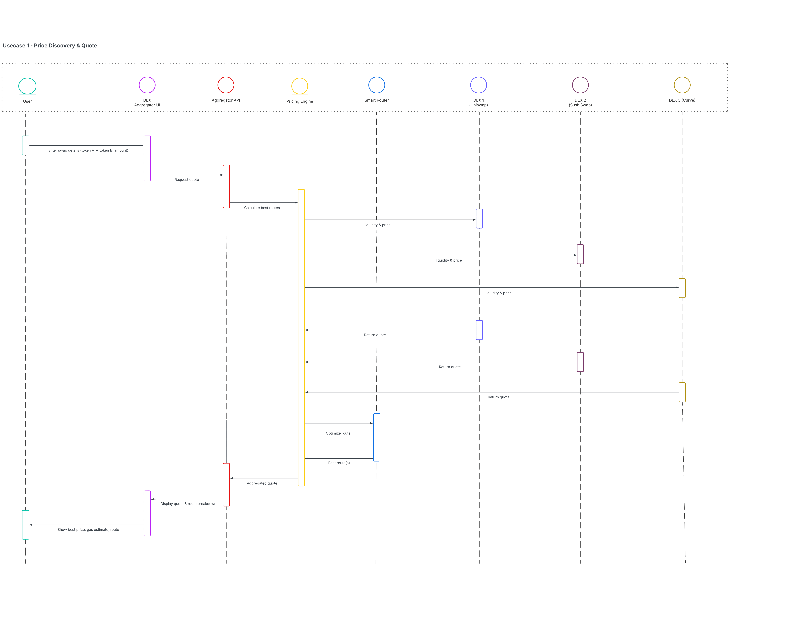
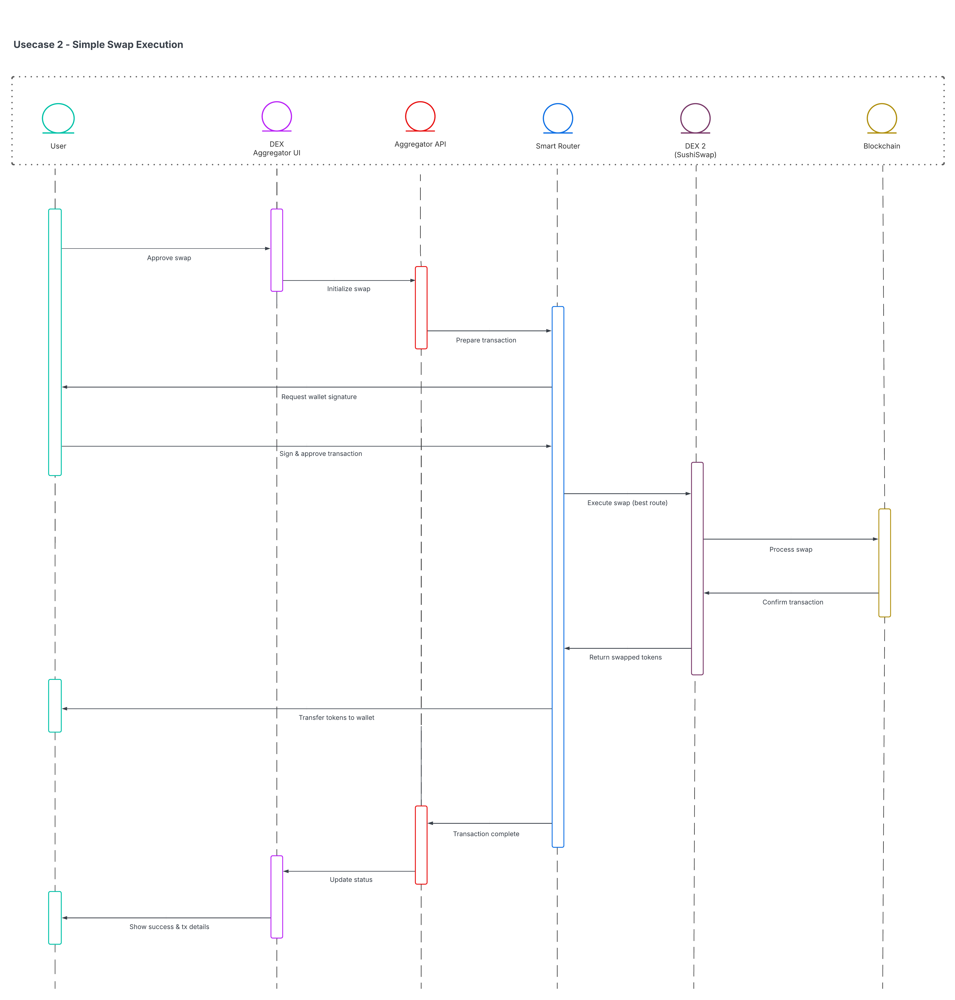
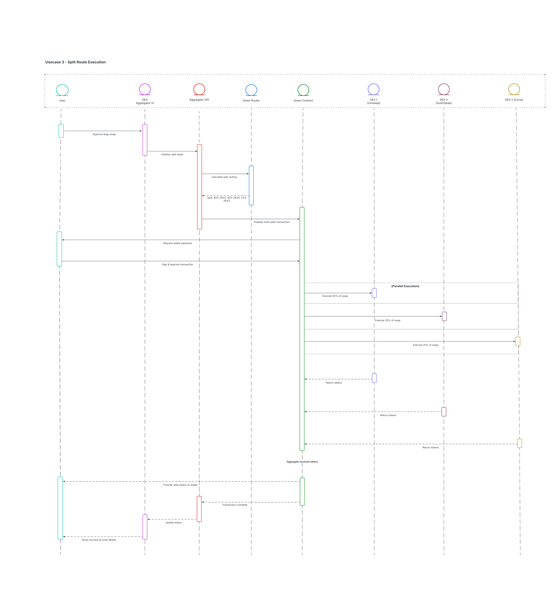
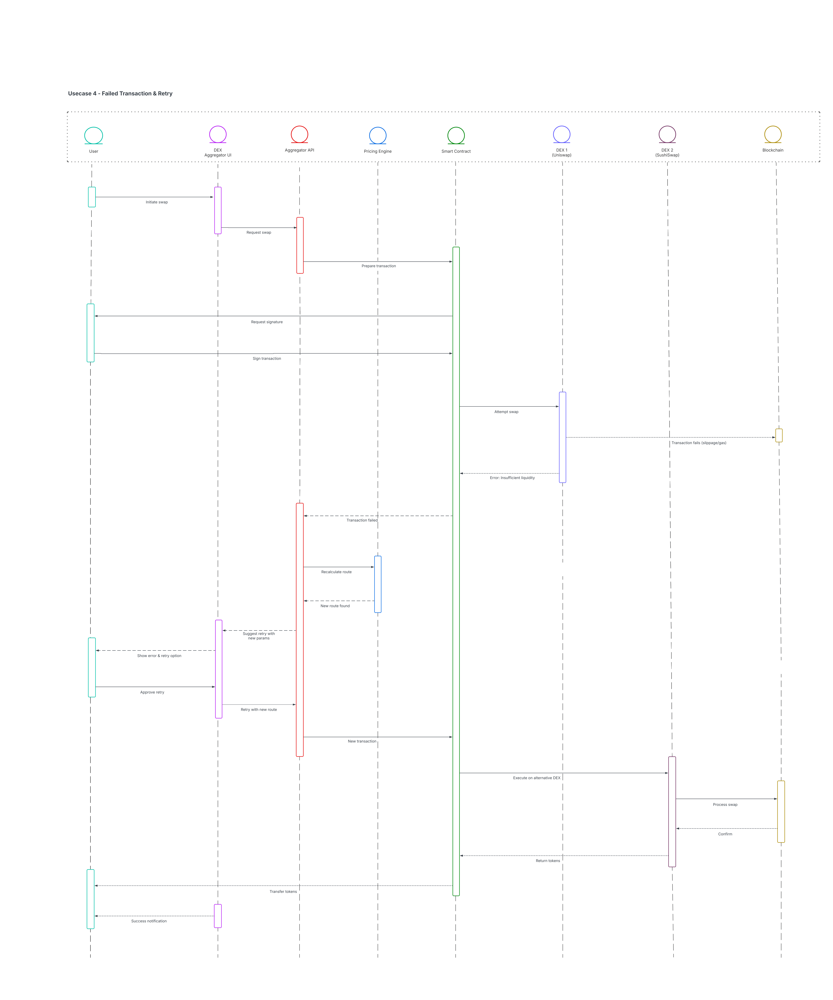

# DEX Aggregator

A decentralized exchange aggregator for Polkadot AssetHub that compares prices across multiple Uniswap V2 and V3 compatible DEXes to find the best swap routes with optimal pricing.

## Features

- Multi-DEX price aggregation (V2 and V3 protocols)
- Smart route optimization with split routing
- Real-time quote comparison and refresh
- Slippage protection and price impact analysis

## Requirements

- Node.js 16+ or higher
- Yarn package manager
- Web3 wallet (MetaMask, WalletConnect, etc.)
- Polkadot EVM Sidechain RPC access

## Quick Start

### Backend Setup

1. **Install Dependencies**
   ```bash
   cd backend
   yarn install
   ```

2. **Configure Environment**
   ```bash
   cp .env.example .env
   ```
   Edit `.env` with your configuration:
   - `RPC_URL` - Polkadot EVM Sidechain RPC URL
   - `FACTORY_ADDRESS` - V2 DEX Factory address
   - `ROUTER_ADDRESS` - V2 DEX Router address
   - `V3_FACTORY_ADDRESS` - V3 DEX Factory address
   - `V3_QUOTER_ADDRESS` - V3 Quoter address

3. **Start API Server**
   ```bash
   yarn build
   yarn api
   ```
   API will be available at `http://localhost:3000`

### Frontend Setup

1. **Install Dependencies**
   ```bash
   cd client
   yarn install
   ```

2. **Configure Environment**
   ```bash
   cp .env.example .env.local
   ```
   Set `NEXT_PUBLIC_API_URL=http://localhost:3000`

3. **Start Development Server**
   ```bash
   yarn dev
   ```
   App will be available at `http://localhost:3001`

## Tech Stack

**Backend:**
- Node.js + TypeScript
- Express.js REST API
- Viem (Ethereum interactions)
- Adapter pattern for DEX integrations

**Frontend:**
- Next.js 15 + React 19
- Wagmi + Viem (Web3 hooks)
- Web3Modal (Wallet connection)
- Tailwind CSS + Radix UI
- TanStack Query (State management)

**Smart Contracts:**
- Solidity ^0.8.20
- Uniswap V2/V3 compatible interfaces

## Build

## Project Workflows

### Price Discovery Flow

Aggregator queries multiple DEXes to find the best price for token swaps:



### Swap Execution Flow

Execute swaps with automatic best route selection and slippage protection:



### Split Route Optimization

Optimizes trades by splitting orders across multiple DEXes for better pricing:



### Failed Transaction Retry

Automatic retry mechanism with adjusted gas and slippage parameters:



### Limit Order Management

Place and manage limit orders across integrated DEXes:


## API Endpoints

### Aggregator Routes
- `POST /api/aggregator/quote` - Get best quote across all DEXes
- `POST /api/aggregator/build-tx` - Build transaction for execution
- `GET /api/aggregator/health` - Health check

### V2 Routes
- `GET /api/v2/pairs` - Get available trading pairs
- `POST /api/v2/quote` - Get V2 swap quote
- `GET /api/v2/reserves/:pairAddress` - Get pair reserves

### V3 Routes
- `POST /api/v3/pools` - Find V3 pools for token pair
- `POST /api/v3/quote` - Get V3 swap quote with fee tiers
- `GET /api/v3/liquidity/:poolAddress` - Get pool liquidity

## Architecture

The project uses a modular architecture:

- **Adapter Pattern**: Abstraction layer for different DEX protocols (V2/V3)
- **Service Layer**: Business logic for quote aggregation and routing
- **Token Registry**: Centralized token configuration management
- **View Model Pattern**: Frontend state management with SwapViewModel
- **API Client**: Custom fetch-based client with retry logic

## Configuration

### Supported DEXes

Configure DEXes in `/backend/src/config/dexes.ts`:
- **Hammy Swap** (V2 Protocol)
- **Surge DEX** (V3 Protocol)

### Token Support

Add tokens in `/backend/src/config/tokens.ts` with:
- Token address
- Symbol and name
- Decimals
- Chain ID

### Fee Tiers (V3)

V3 DEXes support multiple fee tiers:
- `0.01%` - Stable pairs (USDC/USDT)
- `0.05%` - Stable pairs (DAI/USDC)
- `0.30%` - Most pairs (WETH/USDC)
- `1.00%` - Exotic pairs

## Smart Contract

The `DexAggregator.sol` contract provides:
- `swapV2()` - Execute V2 protocol swaps
- `swapV3()` - Execute V3 protocol swaps
- `smartSwap()` - Automatic routing based on backend recommendation
- `recoverToken()` - Emergency token recovery

Deploy to Polkadot EVM Sidechain using standard Hardhat/Foundry workflows.

## Development

### Run Examples
```bash
cd backend
yarn example:pairs        # Fetch available pairs
yarn example:price        # Get V2 price quotes
yarn example:v3:price     # Get V3 price quotes
yarn example:v3:pools     # Find V3 pools
```

### Project Structure
```
DexAggregator/
├── backend/              # Express API server
│   ├── src/
│   │   ├── api/         # Routes and server
│   │   ├── adapters/    # DEX adapters
│   │   ├── services/    # Business logic
│   │   ├── config/      # Configuration
│   │   └── contracts/   # ABIs
│   └── contracts/       # Solidity contracts
├── client/              # Next.js frontend
│   └── src/
│       ├── app/         # Pages (dashboard, pool, stake, lend)
│       ├── components/  # UI components
│       ├── network/     # API client
│       └── viewmodels/  # State management
└── docs/                # Documentation and diagrams
```

## Hackathon Submission

**Event:** Polkadot AssetHub Hackathon

**Category:** DeFi Infrastructure

**Key Innovation:** Multi-protocol DEX aggregation with intelligent route splitting and automatic retry mechanisms for optimal swap execution on Polkadot AssetHub.

## License

MIT License - see LICENSE file for details

## Contributing

Contributions are welcome! Please open an issue or submit a pull request.

## Support

For issues or questions:
- Open a GitHub issue
- Review API documentation in `/docs/API_DOCS.md`
- Check environment configuration in `.env.example`
